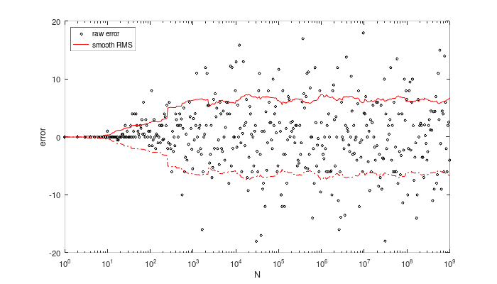
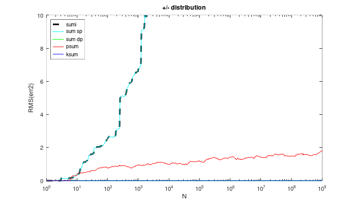
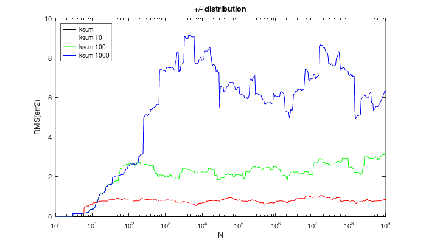
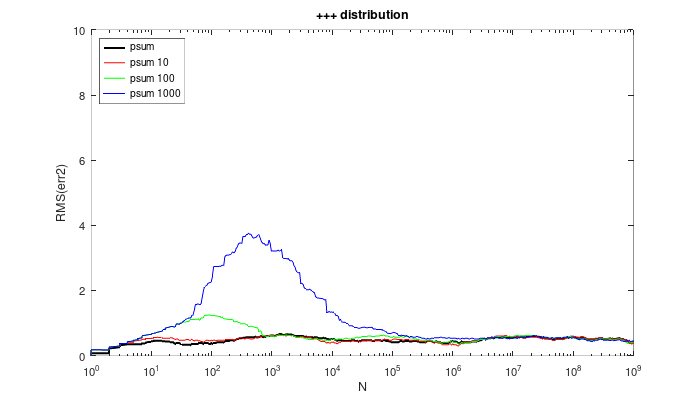
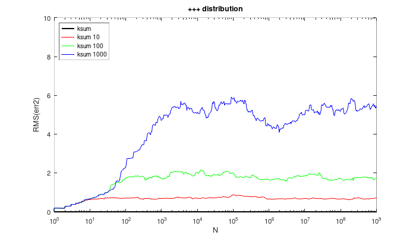
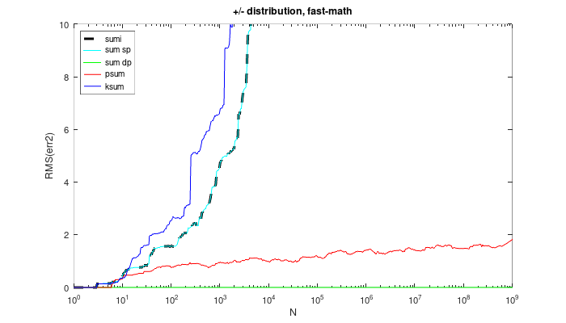

Benchmark of 1D floating point summation methods
================================================

Motivated by [this discussion](https://www.illicado.com/partenaires/enseigne-amazon.html) on the Fortran discourse.

Takeaway
--------

The intrisinc Fortran `sum()` function is visibly implemented by a simple loop with an accumulator of the same precision as the array to sum (remind the Fortran standard does mostly not specify implementation details, and leave that to the compiler writers). This can lead to catastrophic cumulative errors for large numbers of elements $n$ to sum.

The straighforward solution consists in using a higher accumulator in the loop: this is both fast and highly accurate. This is however not always possible.

The Kahan summation is another classic algorithm that keeps the accuracy constant whatever $n$, but at the expanse of a significantly higher runtime (several times the one of straight summation).

The pairwise summation is another algorithm that gives in practice as good accuracies as the Kahan summation, and in some cases much better accuracies than predicted by the theory, with variants that are only 30% slower than a straight summation with a higher precision accumulator.

Preamble
--------

We benchmark the runtimes and accuracies of several methods of the summation of N single precision floating point values $S(n)=\sum_{i=1..N}{x_i}$:
- **sumi**: intrinsic Fortran `sum()` function (using the gfortran compiler)
- **sum_**: straight summation: simple do loop with an accumulator. The accumulator can be:
  - **sum_sp**: single precision accumulator
  - **sum_dp**: double precision accumulator
  - **sum_qp**: quadruple precision accumulator
- **psum**: [pairwise summation](https://en.wikipedia.org/wiki/Pairwise_summation). 
  - **psum_k**: variation where the intrinsic sum is used once $k$ elements or less are left in the recursion ($k=2$ for the default pairwise summation)
- **ksum**: [Kahan summation](https://en.wikipedia.org/wiki/Kahan_summation_algorithm). 
  - **ksum_k**: variation where the different steps of the summation are performed on chunks of $k$ elements, with the $k$ results classicaly summed at the end.

The tests are performed on a x86 machine (an old Core i5 2500K from 2011), with the gfortran 12 compiler. All floating point types are IEEE-754. The single and double are native, and the quadruple is software emulated.  

Accuracy analysis
-----------------

In the litterature, we find that the maximum absolute error of the sum of $n$ elements, $S(n)=\sum_i{x_i}$ is bounded by $Err0_max(n)=\frac{\epsilon f(n)}{1-\epsilon f(n)}\sum_i{|x_i|}$, where $\epsilon$ is the machine precision (about $10^{-7}$ for IEEE-754 single precision), and $f(n)$ a function that depends on the summation method:
|                  | $f(n)$            | Notes |
|------------------|-------------------|-------|
| straight         | $n$               | $\epsilon$ is the one of the accumulator! |
| pairwise         | $\log_2{n}$       |       |
| Kahan            | $1$               |       |

Note the denominator that can lead to catastrophic errors when $\epsilon f(n)$ is no longer negligible wrt $1$ (say above $0.1$). For the straight summation in single precision it means as soon as $n$ is larger than $10^6$, and in double precision larger than $10^{14}$. The classical example is the straight summation of $x_i=1.0$ in single precision: the actual sum is equal to $n$ for $n<=2^{24}=16777216$ (24 being the number of bits in the mantissa in single precision), and to $16777216$ whatever $n>2^{24}$, since $2^{24}+1.0=2^{24}$.

**In the rest of the document we assume that we are in the case where the denominator can be neglected**: $1-\epsilon f(n)<<1$

The maximum absolute error is then $err0_{max}(n)=\epsilon f(n) \sum_i{|x_i|}$. This worst case happens when all the rounding errors have the same sign. In practice they are most of time of random sign, and the error behaves as a random walk. The error has then a normal distribution, and we can take the standard deviation as the average error:

$err0(n)=?\epsilon \sqrt{f(n)/12} \sum_i{|x_i|}$

However, this is apparentely not that simple, as \sum_i{|x_i|} term is also a worst case one. The exact accurracy analysis looks complicated, and instead we use in practice the asymptotic behavior:

$err0(n)=\epsilon O(\sqrt{f(n)}) \sum_i{|x_i|}$

But what is often considered instead of the absolute error is the relative error:

$err1(n)=\frac{err0(n)}{S(n)}=\epsilon O(\sqrt{f(n)}) . c$ 

Where $c=\frac{\sum_i{|x_i|}}{\sum_i{x_i}}$ is the [condition number of the summation](https://en.wikipedia.org/wiki/Pairwise_summation#Accuracy), which is independent from the summation method.

And finally it can also be meaningful to express the error in terms of spacing between two floating points at the value of the sum. The spacing can be roughtly approximated by $\delta(x) \approx \epsilon.x$.

$err2(n)=e.\frac{err0(n)}{\delta(S(n))}=e.O(\sqrt{f(n)}).c$

$e=1$, except for straight summation with higher precision summations where $e=\frac{\epsilon}{\epsilon_{sp}}$

When taking into account all the flavors, we get the following table:
|                  | $e$         | $f(n)$       | $err2(n)$ |
|------------------|-------------|--------------|-----------|
| sumi             |?            | ?            | ?         |
| sum_sp           |$1$          | $n$          | $O(\sqrt{n}) . c$ |
| sum_dp           |$~2.10^{-9}$ | $n$          | $2.10^{-9}O(\sqrt{n}) . c$ |
| sum_qp           |$~2.10^{-27}$| $n$          |$2.10^{-27}O(\sqrt{n}) . c$ |
| psum             |$1$          | $\log_2{n}$  | $O(\sqrt{\log_2{n}}) . c$ |
| psum_k           |$1$          | $\log_2{n}+k$| $O(\sqrt{\log_2{n}+k)}) . c$ |
| ksum             |$1$          | $1$          | $O(1) . c$ |
| ksum_k           |$1$          | $k$          | $O(\sqrt{k}) . c$ |

In practice, the average error of **sum_dp** is excellent: $err2(n)$ is larger than $1.0$ only for $n > 10^{18}$. No need to say that with current machine capacities such a large number of elements is totally unlikely. So where is the need of other algorithms? An answer is for instance "in case one wants to sum double precison values while keeping the double precision in the sum, and no higher precision accumulator is available". On x86 machines there exists the native "extended precision" format (80 bits), but such a format does not exist on all architectures. The compilers often propose the quadruple precision, but as of today it is most of time software emulated, hence quite slow as we will see below. 

Benchmarks
----------

The values to sum are random numbers, with two different distributions:
- **+/- distribution** : uniform distribution in the $\[-0.5 ; 0.5\[$ interval. The expectation of the sum is $0$ and consequently the condition number can raise to $+\infty$. Since the relative error $err2$ can be unstable in these conditions, we use the spacing at the expected standard deviation of the summation, which is $\sqrt{n/12}$ (*).
- **+++ distribution** : uniform distribution in the $\[1.0 ; 2.0\[$ interval. The expectation of the sum is $1.5\*n$, and the condition number is always $1$.

The code ([here](../src/sums.f90) and [here](../src/sums_bench.F90)) is compiled either with:
- `gfortran -O3 sums.f90 sums_bench.F90`
- `gfortran -O3 -ffast-math -DFAST sums.f90 sums_bench.F90`

(\*) this actually raises the question about the reference value used to determine the relative error for a sum that has an expectation equal to $0$. Say we are correlating two normalized time series $\sum_i{x_iy_i}$, where $\sum_i{x_i^2}=1$ and $\sum_i{y_i^2}=1$ . In the case $y=x$ the correlation is perfect and the sum is $1.0$. If $y$ is mostly uncorrelated to $x$, the sum will have a tiny value, say $1.e{-4}$, but what we usually want here is the precision of this result with respect to $1.0$, not with respect to itself. In other terms, we don't mind having a $10^-{11}$ precision at $10^{-4}$, the same $10^{-7} as around $1.0$, which is the maximum possible value of this sum, is OK. Note that the $\sqrt{n/12}$ retained in these tests is a compromise between the maximum possible value $0.5\*n$ and the actual sums that can be as tiny as possible.  

Runtime benchmark
-----------------

We use here only the "+/- distribution" with $n=2^{30}$ elements, the runtimes are summarized on this graph:

Observations:
- the **sum_qp** runtime is clipped on the graph, it is $37.6 sec.$, and $30.8 sec.$ in fast-math: as expected, it is horribly slow.
- The intrisic **sumi** has the same runtimes than **sum_sp** : we can hence suspect it is just a straight summation with a single precision accumulator
- The fast-math compilation makes huge difference (about a 3x speed-up) for all the straight summations (except **sum_qp**). This is probably because the loop can be vectorized in these conditions. 
- **sum_dp** is about 50% slower than **sum_sp** with fast-math.
- The default **psum** and **ksum** are significantly slower than the straight summations
- **psum_k** can however get runtimes that are quite close to **sum_dp** ("only" 50% slower with fast-math), at the expanse of a slighty worse accuracy (but still very acceptable)
- **ksum_k** remains 2x to 3x slower than **sum_dp** with fast-math.

Accuracy benchmark
------------------

Unless otherwise specified, we are looking at the benchmarks with the default compilation only (no fast-math). We are summing random numbers for values of $n$ from $2$ to $2^{30}$. The distribution of the errors being following a normal distribution, the graphs can be a bit obscure (black points below), so what we will plot in the rest of the document is a moving root mean square (RMS) value:

All graphs have a logarithmic horizontal axis. In this representation, a $f(n)=\sqrt{n}$ law looks like an exponential, and $f(n)=\sqrt{log_2(n)}$ looks like a $\sqrt{()}$ curve.

An important point to determine the error is the reference result, supposed to be the "true summation". It could have been the **sum_qp** result, as the theoretical behavior ensures an extremely low error for the range of $n$ we use, but **sum_qp** proved to be too slow for repeated tests. Instead we use a straight summation with an extended precision accumulator (80 bits floating point with 18 significant digits). 

# "+/-" distribution

First we compare the genuine versions of the methods:

Observations:
- **sum_dp** and **ksum** have constantly an error that is equal to zero
- **sumi** and **sum_sp** behave exactly the same, with superimposed curves that grow exponentially. This tends to show that the intrinsic sum is implemented as a straightforward loop with a single precision accumulator
- **psum** has a behavior that looks like the expected the expected $\sqrt{()}$ shape.

Looking now at the variants of **psum** specifically:

Observations:
- **psum_10** as almost the same accuracy as **psum** (but is 2x faster, as seen above)
- For **psum_100** and **psum__1000** the errors first grow up to the number of elements that are classically summed, then tend to be moer or less constant rather than to fallow a $\sqrt{()}$ behavior. This can easily be explained from the theoretical behavior of $Err2$, where the $k$ value -which is constant- tend to rule the error for the range of $n$ that are tested here
- even **psum_1000** has an error less than 10 ($Err2=10$ means that a full significant digit is lost on average).

Looking now at the variants of **ksum** specifically:

- the error first grow fast up to the number of elements in the chunk, then it tends to follow a constant trend
- even **ksum_1000** has an error less than 10 ($Err2=10$ means that a full significant digit is lost). The main interest is that the average error is supposed to be kept constant whatever $n$ above the chunk size.

# "+++" distribution

First we compare the genuine versions of the methods:

Observations:
- **ksum** and **sum_dp** have constantly an error that is equal to zero
- **sumi** and **sum_sp** behave exactly the same, with superimposed curves that grow exponentially. This definitely shows that the intrinsic sum is implemented as a straightforward loop wih a single precision accumulator
- **psum** has an overall constant error, while a $\sqrt{()}$ shape is expected.

Looking now at the variants of **psum** specifically:

Observations:
- the error first grow fast up to the number of elements that are classical summed, then it gets back to a small constant error, instead of the expected $\sqrt{()}$ behavior.
- even **psum_1000** has an error less than 4 ($Err2=10$ means that a full significant digit is lost).

These results on **psum** look extremely surprising at first, but after double checking and some simulations of how the errors accumulate during the summations, il looks like they are completely correct. **It shows that in some cases, the theoretical average error is quite pessimistic**. And it makes the pairwise summation a very attractive algorithm in pratice.

Looking now at the variants of **ksum** specifically:

- the error first grow fast up to the number of elements in the chunk, then it tends to keep a constant trend
- even **ksum_1000** has an error less than 10 ($Err2=10$ means that a full significant digit is lost). The main interest is that the average error is supposed to be kept constant whatever $n$ above the chunk size.

Note that there is no "good suprise" with **ksum**, in contrast to **psum**

Accurracy benchmark with fast-math
----------------------------------

The `-ffast-math` option of `gfortran` authorizes the optimizer to rearrange the order of the operation, as long as this is mathematically equivalent. However "mathematically equivalent" does not mean equivalent in terms of floating point arithmetic. What can be the impact on our benchmark?

First a general result for the "+/-" distribution:

Observations:
- The curves look overall similar to the non-fast versions, except for **ksum** that has now catastrophic errors, even poorer than the single precision straight summation. This is a known effect of fast-math style option, which defeat the compensation term in Kahan algorithm.

Let's compare more precisely with or without fast-math on the same graph:

Observations
- so, not only the fast-math option dramatically speeds-up the sums, but it also improves the accuracy. The one of the straight sum, in the first place: because the summation loop is vectorized, some partial sums are computed then reducted. The benefit is a similar to the one obtained with the pairwise summation algorithm (not quantitavely, of course). In turns, the chunked pairwise summation takes advantage of this better accuracy.

.

------------------------------------
.

