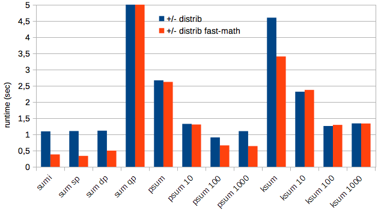
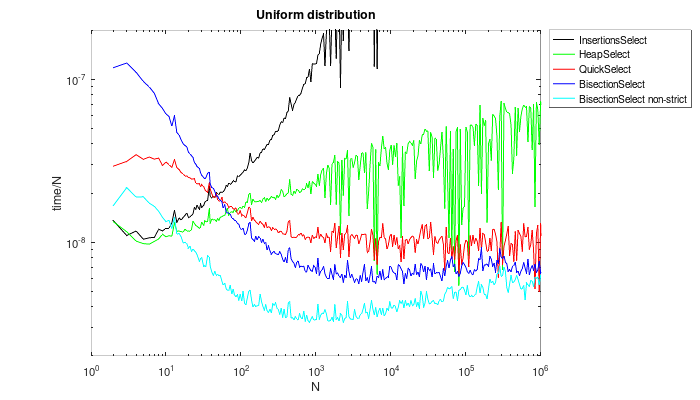
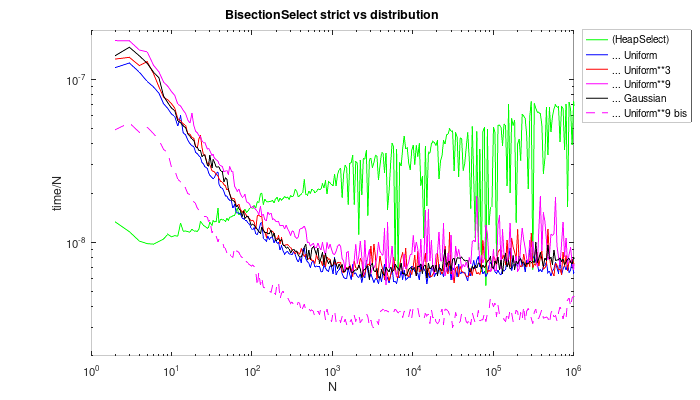
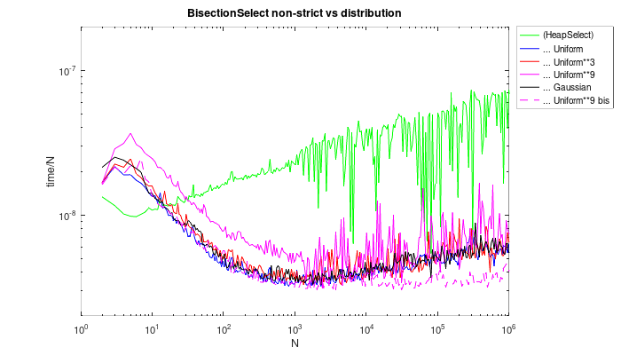
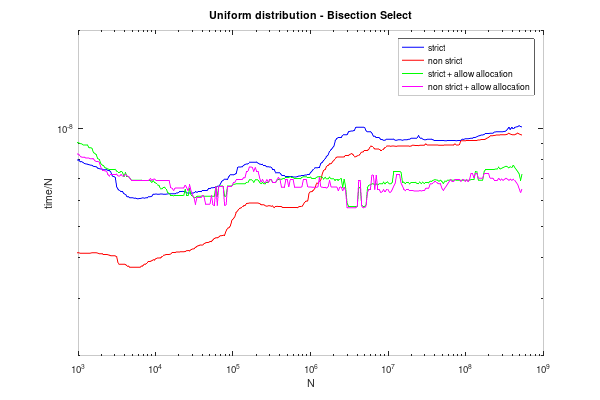
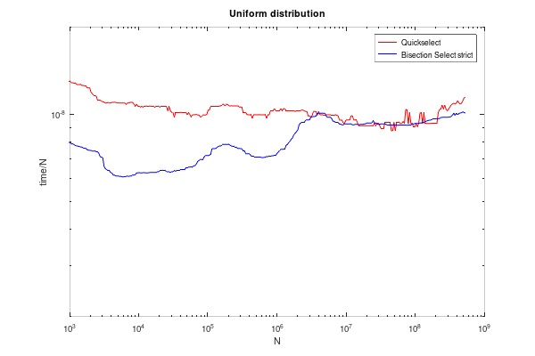
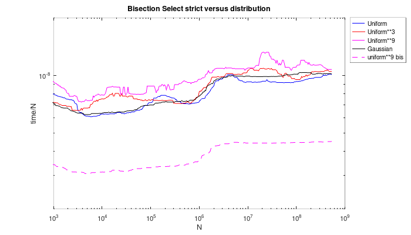
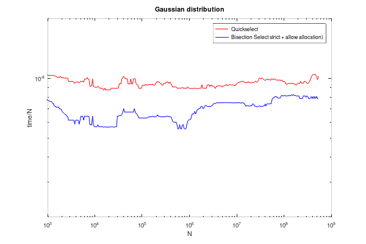
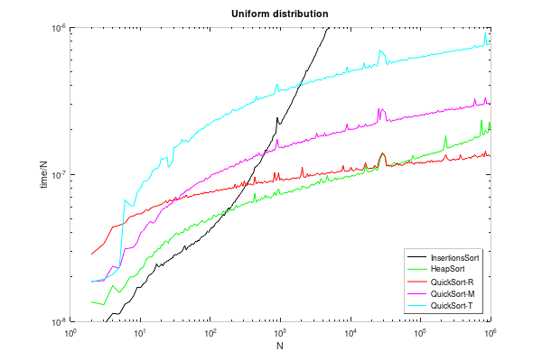
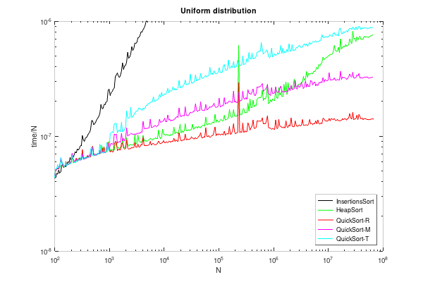

Benchmark of 1D floating point summation methods
================================================

Preamble
--------

We benchmark the runtimes and accuracies of several methods of the summation of N single precision floating point values $S(n)=\sum_{i=1..N}{x_i}$:
- **sumi**: intrinsic Fortran `sum()` function (using the gfortran compiler)
- **sum_**: straight summation: simple do loop with an accumulator. The accumulator can be:
  - **sum_sp**: single precision accumulator
  - **sum_dp**: double precision accumulator
  - **sum_qp**: quadruple precision accumulator
- **psum**: [pairwise summation](https://en.wikipedia.org/wiki/Pairwise_summation). 
  - **psum_k**: variation where the intrinsic sum is used once $k$ elements or less are left in the recursion ($k=2$ for the default pairwise summation)
- **ksum**: [Kahan summation](https://en.wikipedia.org/wiki/Kahan_summation_algorithm). 
  - **ksum_k**: variation where the different steps of the summation are performed on chunks of $k$ elements, with the $k$ results classicaly summed at the end.

The tests are performed on a x86 machine (an old Core i5 2500K from 2011), with the gfortran 12 compiler. All floating point types are IEEE-754. The single and double are native, and the quadruple is software emulated.  

Accuracy analysis
-----------------

The maximum absolute error of the sum of N elements, $S(n)=\sum_i{x_i}$ is bounded by $Err0_max(n)=\frac{\epsilon f(n)}{1-\epsilon f(n)}\sum_i{|x_i|}$, where $\epsilon$ is the machine precision (about ~$10^{-7}$ for IEEE-754 single precision), and $f(n)$ a function that depends on the summation method:
|                  | $f(n)$            | Notes |
|------------------|-------------------|-------|
| straight         | $n$               | $\epsilon$ is the one of the accumulator! |
| pairwise         | $\log_2{n}$       |       |
| Kahan            | $1$               |       |

Note the denominator that can lead to catastrophic errors when $\epsilon f(n)$ is no longer negligible wrt $1$ (say above $0.1$). In single precision it means as soon as $n$ is larger than $10^6$, and in double precision larger than $10^{14}$. The classical example is the straight summation of $x_i=1.0$ in single precision: the actual sum is equal to N for $N<=2^{24}=16777216$ (24 being the number of bits in the mantissa of a IEEE754 single precision floating point), and to 16777216 whatever $N>2^{24}$, since $2^{24}+1.0=2^{24}$.

**In the rest of the document we assume that we are in the case where the denominator can be neglected**: $Err0_max(n)=1-\epsilon f(n)<<1$

The maximum absolute error is then $Err0_max(n)=\epsilon f(n) \sum_i{|x_i|}$. This worst case happens when all the rounding errors have the same sign. In practice they behave as a random walk, with signs that can be either positive or negative. The error has then a normal distribution, and we can take the standard deviation as the average error:

$Err0(n)=\epsilon \sqrt{f(n)/3} \sum_i{|x_i|}$

What is often considered instead of the absolute error is the relative error:

$Err1(n)=\frac{Err0(n)}{S(n)}=\epsilon \sqrt{f(n)/3} . c$ 

Where $c=\frac{sum_i{|x_i|}}{\sum_i{x_i}}$ is the [condition number of the summation](https://en.wikipedia.org/wiki/Pairwise_summation#Accuracy), which is independent from the summation method.

And finally it can also be meaningful to express the error in terms of spacing between two floating points at the value of the sum. The spacing can be roughtly approximated by $\delta(x) \approx \epsilon.x$.

$Err2(n)=e.\frac{Err0(n)}{\delta(S(n))}=\sqrt{f(n)/3}.c$

$e=1$, except for straight summation with higher precision summations where $e=\frac{\epsilon}{\epsilon_{sp}}$

When taking into account all the flavors, we get the following table:
|                  | $e$         | $f(n)$       | $Err2(n)$ |
|------------------|-------------|--------------|-----------|
| sumi             |?            | ?            | ?         |
| sum_sp           |$1$          | $n$          | $\sqrt{n/3} . c$ |
| sum_dp           |$~2.10^{-9}$ | $n$          | $2.10^{-9}\sqrt{n/3} . c$ |
| sum_qp           |$~2.10^{-27}$| $n$          |$2.10^{-27}\sqrt{n/3} . c$ |
| psum             |$1$          | $\log_2{n}$  | $\sqrt{\log_2{n}/3} . c$ |
| psum_k           |$1$          | $\log_2{n}+k$| $\sqrt{(\log_2{n}+k)/3} . c$ |
| ksum             |$1$          | $1$          | $\sqrt{1/3} . c$ |
| ksum_k           |$1$          | $k$          | $\sqrt{k/3} . c$ |

A comment: in practice, the average error of **sum_dp** is excellent: $Err2(n)$ is larger than $1.0$ only for $n > 10^{18}$. No need to say that with current machine capacities such a large number of elements is totally unlikely. So where is the need of other algorithms? An answer is for instance "in case one wants to sum double precison values while keeping the double precision in the sum, and no higher precision accumulator is available". On x86 machines there exists the native "extended precision" format (80 bits), but such a format does not exist on all architectures. The compilers afiten 

Benchmarks
----------

The values to sum are random numbers, with two different distributions:
- **+/-** : uniform distribution in the $[-0.5 ; 0.5[$ interval. The expectation of the sum is 0, and the expected standard deviation is $\sqrt(N/12)$
- **+++** : uniform distribution in the $[1.0 ; 2.0[$ interval. The expectation of the sum is $1.5*N$, and the expected standard deviation is $\sqrt(N/12)$

The [code](../src/sums_bench.F90) is compiled either with:
- `gfortran -O3 sums_bench.F90`
- `gfortran -O3 -ffast-math -DFAST sums_bench.F90`

Runtime benchmark
-----------------

We use here only the "+/- distribution" with $N=2^30$ elements, the runtimes are summarized on this graph:




Observations:
- the **sum_qp** runtime is clipped on the graph, it is $37.6 sec.$, and $30.8 sec.$ in fast-math. This is horribly slow, and totally overkill for this number of elements to sum. We benchmarked it anyway to show the dramatic runtime increase in the case one need an accumulator of a type that is not native on the hardware.
- The intrisic **sumi** has the same runtimes than **sum_sp** : we hence can suspect that it is just a straight sum with single precision accumulator
- The fast-math compilation makes huge difference for all the straight summations (except **sum_qp**), about a 3x speed-up. This is probably because the loop is vectorized in these conditions. 
- The default **psum** and **ksum** are significantly slower than the straight summations
- **psum_k** can however get runtimes that are quite close to 
- With standard compilation, **psum_k** or **ksum_k** can get similar runtimes to the straight summations, at the expanse of a slightly worse accuracy. Still, the accuracy remains much better than with **sum_sp**. With fast-math, however, the straight summations are about 3x faster.
- **sum_dp** is about 50% slower than **sum_sp** with fast-math.

Bisection Select
----------------

The simplified algorithm in pseudo-code is:
```
v1 = minval(a)      ; v2 = maxval(a)
k1 = count(a <= v1) ; k2 = count(a <= v2)
do loop
	if k2 == k                              (1)
		return v2       
		(end of loop)
	v0 = max( (v1+v2) / 2 , next(v1) )      (2)
	k0 = count(a <= v0)
	if k0 >= k
		v2 = v0
		k2 = k0
	else
		v1 = v0
		k1 = k0
```
Quite simple... There are some subtle complications, though
1. whether the type of a(:) is real or integer, there are only a finite number of representable
   numbers. If several elements of the array have exactly the same value, we can have the
   case where no representable value v honor the condition "count(a(:) < v) == k". And in this
   case the bisection won't stop until there's no more value between v1 and v2. So (1) must be
   modified to: 
   ```
   if k2 == k or v2 == next(v1)            (1)
   ```
   where `next(v1)` stands for "the next representable value after v1".
2. as a consequence of the previous point, the calculation of the middle of the interval in 
   (2) has to be protected against undesired roundings:
   ```
   v0 = max( (v1+v2) / 2 , next(v1) )      (2)
   ```

In practice, an optional "strict" mode is also implemented, forcing the returned value to 
be present in the input array (so this mode is really a k-th element selection).

This algorithm has two advantages: the input array is not modified and no additional storage
is required. Because no element is moved the overall performance is quite good, with a minimal
amount of cache misses. And if one accepts to allocate a limited amount of additional storage, 
say 10% of the original array size, then at some point the elements between v1 and v2 can be
extracted and copied to a smaller array, resulting in a significant speed-up.

At first glance the complexity is O(N*log(N)) (recursion depth in log(N) and having to count
over N elements at each step). This is a guaranteed one, there is no worst case scenario with
a higher complexity. And in practice it is even better:
* the recursion depth is bounded, thanks to the finite number of representable numbers. So
  ultimately this is rather a O(N*log(M)) algorithm, where M is the number of representable
  numbers between the minimum and maximum value of the array.
* If one allows some limited allocation, at some point there is only N/10 elements to count,
  further maybe only N/100, etc... The worst case scenario is still O(N*log(M)), 
  but the best case is rather be O(N)
  
See the [whole code](../src/sortselect.f90), and the [benchmark code](../test/sortselect_test.f90)

Bisection Select benchmark for "small" values of N
--------------------------------------------------

The algorithm is benchmarked against InsertionSelect, HeapSelect, and QuickSelect.
All benchmarks are performed on an old Core i5 2500K (2011).

The first benchmark is for relatively modest values of N, up to 10^6, to check how the
algorithms behave on the low end. All algorithms are "pure" ones, without falling back to
more efficient ones for small values of N.

The array is filled with random real number, with a uniform distribution between 0.0 and
10000.0. The k-th element to select is randomly determined at each individual run.

All graph have log-log axis. The vertical axis is the runtime per element, i.e. T(n)/n. In this
representation:
* O(N) algorithms appear like (y = cst)
* O(N*log(N)) algorithms appear like (y = cst + log(cst + x))
* O(N^2) algorithms appear like (y = cst + x)



**Observations**
* The non-strict Bisection Select is much more efficient than all other ones. It tends however
  to get closer to the strict version for large N.
* The strict Bisection Select is faster than the canonical QuickSelect, except for less
  than 100 elements.
* HeapSelect has rather a O(N^2) behavior on this graph.
* The overheads for N<1000 are significant for QuickSelect and even more for Bisection Select.
  In contrast there are only small overheads at N<10 for HeapSelect and InsertionSelect.
* InsertionSelect is never the fastest one, whatever N.
* I cant't explain the strong dispersion of the runtimes for N>1000.

Unlike the other algorithms, Bisection Select performance depends on the distribution of
the values. A uniform distribution over a small interval being the best scenario. We
test here different distributions:
* "Uniform": uniform distribution over [0.0;10000.0[
* "Uniform^3": uniform distribution, values to the power of 3, and renormalised over [0.0;10000.0[. The
  histogram has more value near 0.0, with a median at 1250.0.
* "Uniform^9": uniform distribution, values to the power of 9, and renormalised over [0.0;10000.0[. This
  is an extreme version of the previous one, with a median at 19.5.
* "Uniform^9 bis": same as "Uniform^9", but renormalised over [1.0;1.0001[ : this interval has much less
  representable values.
* "Gaussian": (pseudo-)gaussian distribution over [-10000.0;+10000.0]
  
We test the strict version first:
  


**Observations**
* The performances on all the distributions are very close to each other, except for the 
  extreme cases :
  - On "uniform^9" it is about 25% slower
  - On "uniform^9 bis" it is about 4x faster. The algorithm here takes full advantage
    of the "small" number of representable values and can stop the recursions early. Note
    that with any distribution on this interval, there would be the same kind of speed-up
    
Now we test the non strict version:



**Observations**
* The performances on all the distributions are very close to each other, except for the 
  "uniform^9" extreme cases. 
* The penalty can be significant (up to 2x slower), but
  the reason is also that the non strict algorithm is actually much faster overall of more
  regular distributions
* The runtime for "uniform^9 bis" starts being lower for N > 10000, and
  it sticks to a O(n) complexity

  
Bisection Select benchmark for large values of N
------------------------------------------------

Here we benchmark up to N=2^29 (I had trouble going beyond that on my old computer). 
QuickSelect and BisectionSelect can fall back to HeapSelect once the recursion has
narrowed the search to a "small" enough number of elements.

First we look at the different flavors of Bisection Select, for the uniform distribution.
Because of the very strong dispersion of the runtimes, the curves are smoothed (median filter).



Observations:
* The non-strict version is much faster than the strict version for N < 10^6. Above that it
  tends to be similar. 
* I can't explain why the change of behavior is that sharp around N = 10^6, though...
* Allowing some allocation (10% of the initial size of the array) results in a significant
  speed-up (25%) for N > 10^6, but only for the strict version.
* Strangely, allowing allocation has no effect on the non-strict version (and I can't 
  explain why).
  
Now let's compare the strict version to QuickSelect:



Observations:
* Bisection Select is about 30% faster for N < 10^6. The non-strict version would be even faster.
* The performances are similar for N > 10^6

Now looking at the strict version for different distributions:



Observations:
* Same observations as for smaller N value:
* The performances are very similar for the "Uniform", "Uniform^3" and "Gaussian" distributions. 
* There is a (limited) slow-down for the "Uniform^9" distribution
* The "Uniform^9 bis" distribution results in a dramatic speed-up


And finally, let's compare the strict version with allocation allowed to QuickSelect, 
on a gaussian distribution:



Observations:
* The Bisection Select with allocation is constantly faster than QuickSelect


Sorting algorithms benchmark for small values of N
--------------------------------------------------

We compare InsertionSort, HeapSort, and QuickSort. We use only the uniform 
distribution, as these sorting algorithms are not sensitive to the kind of distribution.

QuickSort comes with 3 flavors for the selection of the pivot: 
* (R) random selection (which was used by all QuickSelect tests above)
* (M) approximate median (median of medians algorithm)
* (T) approximate median + partial sorting (the partial sorting is a by-product of the
  median of medians algorithm, but it requires a in-place transposition)
  
The pivot selection based on the "median of medians" aims at ensuring a `O(N*log(N))`
complexity even in the worst case scenario, which is otherwise `O(N^2)`, `O(N*log(N))`
being only the average complexity. But the cost of the "median of medians"
make it almost useless in practice, as seen below.

All algorithms are "pure" ones, without falling back to
more efficient ones for small values of N.



Observations:
* All QuickSort flavors show a clear O(N*log(N)) behavior, with limited overheads for
  small N values. QuickSortR is much faster than QuickSortM, which is much faster than 
  QuickSortT, though.
* HeapSort is more efficient for N < 1000, but gets slower than QuickSortR after that. 
  While the behavior is O(N*log(N)) as expected at the beginning of the curve, it deviates
  from that for larger N. Likely, HeapSort more cache misses that QuickSortR.
* InsertionSelect has the expected O(N^2) behavior, and is faster than all the other ones 
  for N < 100.


Sorting algorithms benchmark for large values of N
--------------------------------------------------

Now we benchmark up to N=2^26 (I had trouble going beyond that on my old computer). 
QuickSort can fall back to HeapSort for small values of N, and HeapSort can fall back to
InsertionSort for even smaller values.



Observations:
* While QuickSortR nicely follows the O(N*log(N)) behavior even for very large N,  
  QuickSortM, QuickSortT and HeapSort constantly get slower and slower (up to 10x slower for N=10^8).
  Again, QuickSortR is much more cache friendly than all the other ones.

